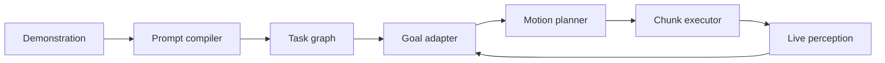

# PromptMorph

**One-shot physical prompting with object-relative, closed-loop replanning.**

PromptMorph compiles one short physical demonstration into an embodiment-independent
task graph, instantiates that graph in a rearranged scene, and invalidates/replans
motion when the world changes. The three-week MVP deliberately targets one capability:

> Given one simulated marker-into-cup demonstration, execute the same intent from
> randomized layouts and recover when the cup moves during the rollout—without
> task-specific training.

The project is simulation-first and designed to run on Google Colab. It does **not**
claim to reproduce a robot foundation model. Instead, it makes one-shot task transfer
explicit, inspectable, and reproducible using 3D geometry and closed-loop planning.

## Current vertical slice

- Typed simulator-independent world state
- Audited SE(3) transforms with explicit `xyzw` quaternion convention
- Pick/place demonstration compiler with ambiguity checks
- Object-relative task graph (`grasp → align → place → release`)
- Live-scene goal adaptation
- Perception-confidence and target-displacement safety gates
- Deterministic replanning demo and unit tests
- PyTorch progress-model training contract for simulator-generated trajectories
- Headless Docker image and container-build CI

## Quick start

```bash
python -m pip install -e ".[dev]"
pytest
promptmorph-demo
```

Expected demo output:

```text
Compiled: marker-into-cup-001 -> 4 subgoals
Initial live goal: (...)
Monitor: replan_required (target moved beyond the active plan validity region)
Replanned live goal: (...)
```

## System boundary



The task graph never imports MuJoCo. Simulation and, later, ROS 2 implement the same
observation/execution protocols. This separation is a non-negotiable production
constraint: task intent must not depend on simulator object IDs or actuator layout.

## Three-week build

### Week 1 — deterministic MuJoCo capability

- Franka Panda tabletop scene with marker, cup, and RGB-D camera
- Record one demonstration as versioned episode data
- Compile it into the object-relative graph
- Execute from at least 20 seeded layouts
- Save video, structured event log, and episode metadata for every run

**Exit gate:** at least 90% success under pose randomization with ground-truth state.

### Week 2 — closed-loop recovery

- Replace monolithic trajectories with 250 ms action chunks
- Move the cup during approach and insertion
- Re-instantiate the Cartesian goal and replan
- Add grasp-loss, timeout, collision, and replan-budget handling
- Train the native sensorimotor progress model from scratch on generated interaction traces
- Retain the learned component only if it improves held-out recovery or plan efficiency
- Run 30 seeded episodes per disturbance type

**Exit gate:** at least 80% recovery success, zero silent failures, deterministic reruns.

### Week 3 — perception and release quality

- RGB-D segmentation/pose adapter behind the `PerceptionBackend` interface
- Confidence-aware execution and pose smoothing
- Colab notebook that runs from a clean runtime
- CI, release tag, 60–90 second demo, and two-page technical report

**Exit gate:** one-command clean installation, all CI green, and no manually edited
state during the recorded demo.

## Definition of “industry level” for this MVP

Industry level does not mean a large number of features. It means a narrow behavior
with evidence that engineers can trust:

1. **Reproducible:** every run stores config, seed, commit, task graph, and events.
2. **Observable:** the demo overlays active subgoal, pose confidence, replan count,
   and the reason a plan was invalidated.
3. **Fail-closed:** uncertain perception, stale observations, timeouts, and exceeded
   replan budgets stop the episode instead of issuing guessed actions.
4. **Testable:** geometry and task compilation are unit-tested; MuJoCo behavior is
   covered by seeded integration tests.
5. **Modular:** perception, planning, and execution use explicit typed interfaces.
6. **Honest:** metrics include all attempted seeds and failure categories, not only
   successful videos.

See [architecture.md](docs/architecture.md), [acceptance.md](docs/acceptance.md), and
[failure-modes.md](docs/failure-modes.md) before expanding the scope. The rationale for
the selected engineering stack is in [technology-stack.md](docs/technology-stack.md),
and the goal-driven ML rules are in [training-principles.md](docs/training-principles.md).

## Non-goals for v0.1

- Training a VLA or diffusion policy
- Fine-tuning an Internet-pretrained vision-language model for robot actions
- Natural-language task planning
- Multiple task families
- Deformable-object manipulation
- Real-robot deployment
- Claiming zero-shot semantic generalization beyond the demonstrated relation

These are intentionally excluded so the one-shot transfer and recovery loop can be
finished and polished within three weeks.

## License

MIT
